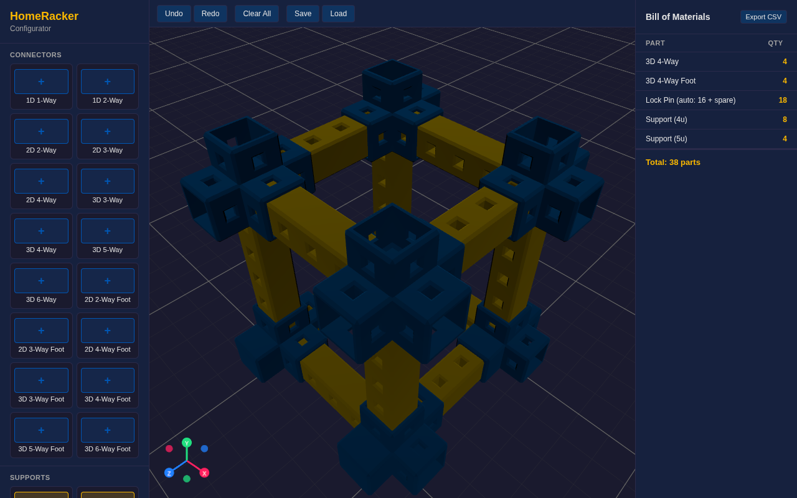

# HomeRacker Configurator

## **[Launch the Configurator](https://zachgoldberg.github.io/homeracker-configurator/)**

A 3D visual planner for [HomeRacker](https://github.com/kellerlabs/homeracker) — the fully modular, 3D-printable rack-building system. Design your rack layout in the browser before printing.



## Features

- **Drag-and-drop parts** — connectors, supports, and lock pins from the parts catalog
- **Snap-to-connect** — supports snap into connector sockets, connectors snap onto support endpoints
- **Orientation-aware placement** — supports auto-orient (X/Y/Z axis) when snapping to connectors
- **Click-and-drag repositioning** — move placed parts with snap assistance
- **Undo/Redo** — full command history with Ctrl+Z / Ctrl+Y
- **Bill of Materials** — live BOM with part counts and lock pin estimates
- **STL import** — load custom STL files as parts in the assembly
- **Export** — save/load assemblies as JSON

## Quick Start

```bash
bun install
bun run dev
```

Open http://localhost:5173 in your browser.

## Controls

| Action | Input |
|--------|-------|
| Place part | Click catalog item, then click ground |
| Rotate (Y axis) | `R` |
| Rotate (Z axis) | `F` |
| Rotate (X axis) | `T` |
| Cycle orientation | `O` (supports only) |
| Move part | Click and drag |
| Select part | Click |
| Undo | `Ctrl+Z` |
| Redo | `Ctrl+Y` / `Ctrl+Shift+Z` |
| Delete selected | `Delete` / `Backspace` |
| Cancel placement | `Escape` |
| Orbit camera | Left-click drag (on empty space) |
| Zoom | Scroll wheel |

## Tech Stack

- [React 19](https://react.dev/) + [TypeScript](https://www.typescriptlang.org/)
- [Three.js](https://threejs.org/) via [@react-three/fiber v9](https://r3f.docs.pmnd.rs/) and [@react-three/drei v10](https://drei.docs.pmnd.rs/)
- [Bun](https://bun.sh/) for bundling, dev server, and runtime
- [Puppeteer](https://pptr.dev/) for e2e tests
- Deployed to [GitHub Pages](https://zachgoldberg.github.io/homeracker-configurator/) via GitHub Actions

## Scripts

```bash
bun run dev              # Start dev server
bun run build            # Production build to dist/
bun run generate-models  # Regenerate GLB models from OpenSCAD
bun run test:e2e         # Run headless e2e tests
bun run test:e2e:headed  # Run e2e tests with visible browser
```

## Project Structure

```
src/
  assembly/       # Grid logic, snap engine, assembly state
  components/     # React components (App, ViewportCanvas, BOM, etc.)
  data/           # Part catalog, connector configs, custom parts
  export/         # Save/load functionality
  constants.ts    # Base unit, colors, grid settings
  types.ts        # Shared TypeScript types
scripts/          # Build, dev server, e2e tests, model generation
public/models/    # GLB part models
```

## License

See the [HomeRacker project](https://github.com/kellerlabs/homeracker) for licensing details.
